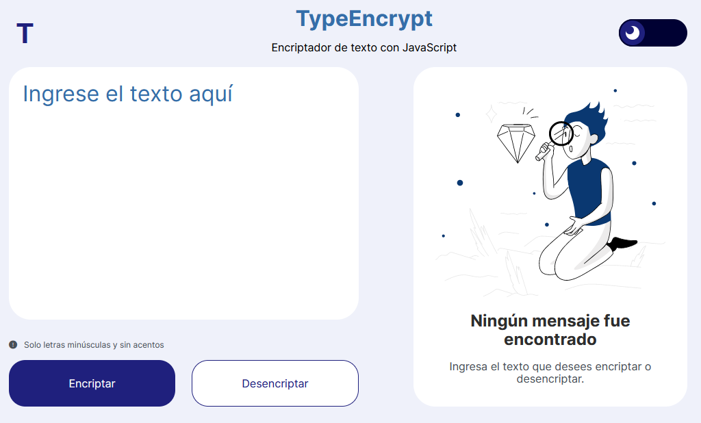

# TypeEncript - Encriptador de texto
### Información General
***
Este proyecto de encriptador de texto simple consiste en reemplazar las vocales de una palabra o frase por sus correspondientes llaves de encriptación.
#### Interfaz

## Lenguajes utilizados
***
A continuación la lista de lenguajes utilizados en el proyecto:
* HTML5 
* CSS3
* JavaScript
## ¿Cómo usarlo?
***
La interfaz cuenta con dos botones principales, uno que permite encriptar y el otro desencriptar el texto ingresado; así mismo, después de realizar alguna
de las dos acciones anteriores aparecerá un botón que permitirá copiar el resultado.
### Funcionamiento
```
La letra "e" es convertida para "enter"
La letra "i" es convertida para "imes"
La letra "a" es convertida para "ai"
La letra "o" es convertida para "ober"
La letra "u" es convertida para "ufat"
```
### Especificaciones
* Solo funciona con letras minúsculas.
* No deben ser utilizados letras con acentos ni caracteres especiales.
* El usuario debe escribir texto antes de intentar encriptar o desencriptar.
## Autor
https://www.linkedin.com/in/daniel-fernando-franco-bermudez-3b814226b/
